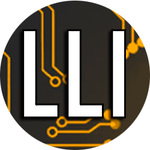

  
  <h3 align="center">!Hola! Soy <a href="https://www.luisllamas.es" target="_blank">Luis Llamas</a> 👋 </h3>  

 

**Acerca de mí**

- 👨 De nacimiento y residencia en España
- 👨‍💻 Soy Ingeniero industrial, y trabajo como desarrollador e IT Proyect manager, IoT e Industria 4.0
- 🎓 También soy divulgador y creador de contenido sobre desarrollo, microcontroladores y electrónica
- ⭐ Mis lenguajes de programación favoritos son C#, C++, JS
- ❤️ Mi web www.luisllamas.es tiene tutoriales sobre Arduino, electrónica, programación, impresión 3D, diseño de PCBs. 

 
 

**Mis estadísticas de GitHub**

  
  

 

**Mis tecnologías**

